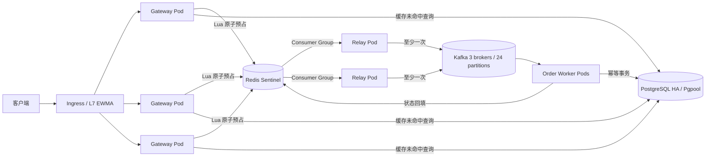

# FlashFlow

FlashFlow 是一个面向秒杀与突发流量场景的完整 Go 分布式订单示例。它把同步请求路径压缩为 Redis 中的一次原子操作，再用 Redis Stream 与 Kafka 两级缓冲削峰，最后由并发消费者将订单幂等写入 PostgreSQL。工程包含可执行服务、数据库迁移、单元测试、本地 Docker Compose 环境、OpenAPI、k6 压测脚本和 Kubernetes 高可用清单。

## 系统能力

- Redis Lua 在同一原子操作内完成库存检查、扣减、用户级幂等、PENDING 状态缓存和 Stream 写入，杜绝应用层并发超卖。
- Relay 使用 Redis consumer group 并发读取，Kafka 收到确认后才执行 `XACK + XDEL`；进程崩溃后由 `XAUTOCLAIM` 接管悬挂消息。
- Order Worker 在单个进程内启动多个 Kafka consumer。每个 consumer 串行处理自己取得的分区消息，避免乱序提交较大 offset 跳过尚未完成的消息。
- PostgreSQL 事务将业务订单与 `processed_events` 幂等记录一并提交。Kafka 至少一次投递不会产生重复订单。
- 网关包含分布式令牌桶、实例级有界并发、严格 JSON 校验、请求超时、优雅停机、结构化日志、健康探针和 Prometheus 指标。
- Kubernetes 使用 Ingress EWMA 负载均衡、多副本 Deployment、HPA、PDB、跨节点/可用区调度和 NetworkPolicy。中间件配置为 Redis Sentinel、三节点 Kafka KRaft 和 PostgreSQL Repmgr + Pgpool。

## 架构



创建订单的成功响应是 `202 Accepted`。此时库存已经预占，订单事件已经可靠地进入 Redis Stream，但 PostgreSQL 订单可能仍在异步创建；客户端根据 `Location` 轮询即可。详细的一致性边界见 [架构设计](docs/architecture.md)。

## 目录

```text
cmd/
  gateway/          HTTP API、限流和库存预占
  relay/            Redis Stream -> Kafka 可靠中继
  order-worker/     Kafka -> PostgreSQL 并发消费者
  migrator/         数据库迁移、商品与库存初始化
internal/
  gateway/          HTTP handler 与中间件
  redisstore/       Lua、缓存、Stream consumer group
  messagebus/       Kafka producer/consumer 封装
  postgres/         事务仓储与嵌入式 SQL 迁移
  relay/ worker/    并发处理与故障恢复
api/openapi.yaml    OpenAPI 3.1 契约
deploy/k8s/         应用、HPA、PDB、Ingress、NetworkPolicy
deploy/middleware/  三套高可用中间件 Helm values
scripts/            冒烟与 k6 负载测试
```

## 本地运行

本地容器运行只需要 Docker Engine 与 Docker Compose v2。直接编译需要 Go 1.25+。Compose 为开发环境启动单节点 Redis、Kafka、PostgreSQL，以及全部四个 Go 进程：

```bash
docker compose up --build -d
docker compose ps
```

第一次构建会执行数据库迁移并创建三个商品和 Kafka topic。健康检查通过后：

```bash
curl http://localhost:8080/v1/products/sku-phone

curl -i -X POST http://localhost:8080/v1/orders \
  -H 'Content-Type: application/json' \
  -H 'X-User-ID: user-1001' \
  -H 'Idempotency-Key: checkout-20260916-001' \
  -d '{"productId":"sku-phone","quantity":1}'

curl -H 'X-User-ID: user-1001' \
  http://localhost:8080/v1/orders/<orderId>
```

Windows 可直接运行完整冒烟流程：

```powershell
./scripts/smoke.ps1
```

停止服务时，`docker compose down` 保留三个数据卷；确实需要清空本地测试数据时再执行 `docker compose down -v`。

## API

完整契约位于 [api/openapi.yaml](api/openapi.yaml)。主要端点如下：

| 方法 | 路径 | 说明 |
|---|---|---|
| `GET` | `/v1/products/{productId}` | 商品与实时可预占库存 |
| `POST` | `/v1/orders` | 原子预占库存并异步创建订单 |
| `GET` | `/v1/orders/{orderId}` | 查询 PENDING / CONFIRMED / REJECTED |
| `GET` | `/health/live` | 进程存活探针 |
| `GET` | `/health/ready` | Redis、PostgreSQL 等依赖就绪探针 |
| `GET` | `/metrics` | Prometheus 指标 |

`POST /v1/orders` 必须带 `X-User-ID` 和 `Idempotency-Key`。同一用户重复提交相同幂等键会得到原订单，不会再次扣库存。示例中的 `X-User-ID` 是便于本地运行的身份边界；生产入口应由 API Gateway 验证 OIDC/JWT 后覆盖该头，不能信任公网客户端直接传入的值。

## 配置

所有进程采用环境变量配置。常用参数及默认值如下：

| 参数 | 默认值 | 作用 |
|---|---:|---|
| `REDIS_ADDRS` | `redis:6379` | 单节点地址，或逗号分隔的 Sentinel 地址 |
| `REDIS_MASTER_NAME` | 空 | 设置后使用 Sentinel failover client |
| `REDIS_POOL_SIZE` | `200` | 每个进程的 Redis 连接池上限 |
| `REDIS_STREAM_MAX_LEN` | `0` | `0` 表示不裁剪；ACK 时会删除记录。正数是允许丢失积压消息的紧急保护上限 |
| `REDIS_WAIT_REPLICAS` | `0` | 接受订单前等待确认的 Redis 副本数；K8s 设为 1 |
| `KAFKA_BROKERS` | `kafka:9092` | 逗号分隔的 broker 地址 |
| `POSTGRES_URL` | 本地 Compose URL | pgx 连接串 |
| `POSTGRES_MAX_CONNS` | `80` | 单进程数据库连接池上限；K8s 配置收紧为 10 |
| `HTTP_MAX_IN_FLIGHT` | `2000` | 单个网关实例同时处理的业务请求上限 |
| `RATE_LIMIT_PER_SECOND` | `20` | 每个用户与来源 IP 的持续速率 |
| `RATE_LIMIT_BURST` | `40` | 分布式令牌桶容量 |
| `RELAY_CONCURRENCY` | `8` | 单个 Relay 的 Stream consumer 数 |
| `WORKER_CONCURRENCY` | `4` | 单个 Worker Pod 内的 Kafka consumer 数 |
| `WORKER_MAX_PROCESS_ATTEMPTS` | `8` | 数据库临时错误触发 Pod 重启前的本地重试次数 |
| `RESET_STOCK` | `false` | 仅用于测试；迁移时强制恢复初始库存 |

完整默认值集中在 [internal/config/config.go](internal/config/config.go)。生产环境不要打开 `RESET_STOCK`，否则重新运行迁移 Job 会覆盖真实库存。

## 测试与压测

```bash
go test ./...
go vet ./...
CGO_ENABLED=1 go test -race ./...
go build ./cmd/gateway ./cmd/relay ./cmd/order-worker ./cmd/migrator
```

CI 在 Linux 上运行格式、vet、race test、全量构建和容器构建。k6 压测默认从 100 RPS 爬升至 1000 RPS，可按环境调节：

```bash
k6 run -e BASE_URL=http://localhost:8080 \
  -e TARGET_RPS=5000 -e HOLD_DURATION=5m scripts/load.js
```

库存耗尽后的 `409` 是业务成功结果，不计入压测错误。压测前可在隔离环境用 `RESET_STOCK=true` 单独执行 migrator，切勿在生产使用。

## Kubernetes 部署

应用清单建议使用仍在官方支持期内的 Kubernetes 1.35+，并安装 Ingress NGINX 和 Metrics Server。下面的中间件 chart 版本与 values 文件匹配；若企业已有托管 Redis、Kafka、PostgreSQL，只需修改 ConfigMap 与 Secret 中的地址。

1. 构建并推送镜像，然后修改 [kustomization.yaml](deploy/k8s/kustomization.yaml) 中的镜像仓库与 tag。

   ```bash
   docker build -t ghcr.io/your-org/flashflow:1.0.0 .
   docker push ghcr.io/your-org/flashflow:1.0.0
   ```

2. 创建命名空间和独立密码。示例 Secret 只提供字段结构，必须替换所有 `CHANGE_ME`。

   ```bash
   kubectl apply -f deploy/k8s/namespace.yaml
   cp deploy/middleware/secret.example.yaml deploy/k8s/middleware-secret.yaml
   cp deploy/k8s/secret.example.yaml deploy/k8s/secret.yaml
   # 编辑两个文件，使应用密码与中间件密码一致
   kubectl apply -f deploy/k8s/middleware-secret.yaml
   kubectl apply -f deploy/k8s/secret.yaml
   ```

3. 安装高可用中间件。存储类、容量和资源限制应按集群调整。

   ```bash
   helm upgrade --install flashflow-redis \
     oci://registry-1.docker.io/bitnamicharts/redis \
     --version 28.0.15 -n flashflow -f deploy/middleware/redis-values.yaml

   helm upgrade --install flashflow-kafka \
     oci://registry-1.docker.io/bitnamicharts/kafka \
     --version 32.4.3 -n flashflow -f deploy/middleware/kafka-values.yaml

   helm upgrade --install flashflow-postgresql-ha \
     oci://registry-1.docker.io/bitnamicharts/postgresql-ha \
     --version 16.3.4 -n flashflow -f deploy/middleware/postgresql-ha-values.yaml
   ```

4. 等中间件 Ready 后部署应用。迁移和 topic Job 都具有幂等性，启动较慢时会自动重试。

   ```bash
   kubectl wait --for=condition=Ready pod --all -n flashflow --timeout=10m
   kubectl apply -k deploy/k8s
   kubectl wait --for=condition=complete job/flashflow-migrator -n flashflow --timeout=5m
   kubectl wait --for=condition=available deployment/gateway -n flashflow --timeout=5m
   ```

5. 修改 [ingress.yaml](deploy/k8s/ingress.yaml) 中的域名和 TLS Secret。若安装了 KEDA，可删除 `order-worker.yaml` 中的 CPU HPA，再应用 [KEDA ScaledObject](deploy/k8s/optional/keda-order-worker.yaml)，按 Kafka lag 扩缩容。

中间件 values 使用内部明文端口，并通过命名空间与 NetworkPolicy 隔离；跨不可信网络部署时应启用 Redis/Kafka/PostgreSQL TLS，并给 Kafka 启用 SASL，同时在客户端配置对应凭据。

## 容灾与容量边界

- Redis 使用 1 主 2 从、3 个 Sentinel，并设置 `min-replicas-to-write=1`。网关在同一连接执行 Lua 与 `WAIT 1`，收到至少一个副本确认后才返回 202；主节点失效时 Sentinel 自动提升偏移量最新的副本。
- Kafka 使用 3 个 KRaft controller/broker，业务 topic 为 24 分区、3 副本、`min.insync.replicas=2`，producer 要求全部 ISR 确认，并禁用不干净 leader 选举。
- PostgreSQL 使用 3 节点 Repmgr、2 个 Pgpool，写入等待任意 1 个同步副本 `remote_apply` 后提交。数据库事件表和订单表在一个事务内更新。
- 网关无状态，可水平扩容；总接入并发约为 `网关副本数 × HTTP_MAX_IN_FLIGHT`。实际吞吐还受 Redis 单主 Lua 执行速率、Kafka 分区数和数据库写入能力限制。
- 一个 Kafka 分区同一时刻只会被 consumer group 中一个 consumer 使用。24 分区意味着最多 24 个活跃订单消费协程，更多 worker 会待命；扩大分区数后再增加消费并发。
- Redis Stream 默认不按长度裁剪，Relay 成功 ACK 时立即删除。应告警监控 pending 数与 Redis 内存；错误地设置 `REDIS_STREAM_MAX_LEN` 可能裁剪未消费订单。

故障注入、告警指标、恢复动作和扩容检查表见 [运维手册](docs/operations.md)。
